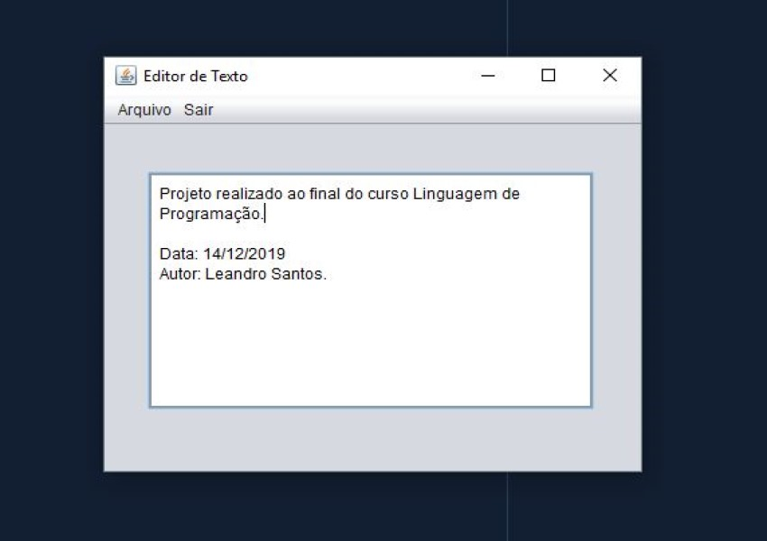

    <h1 alt="editorTexto" title="#editorTexto">Editor de Texto</h1> 
    

## :memo: Projeto Editor de Texto

Projeto feito ao final do curso, aprimorando os conhecimentos aprendidos.

Criar novo projeto java Editor de Texto, usando Swing Application Framework. O Editor de Texto 
terá um menu com as opções de sair, abrir e salvar.

Feito por Leandro Santos.